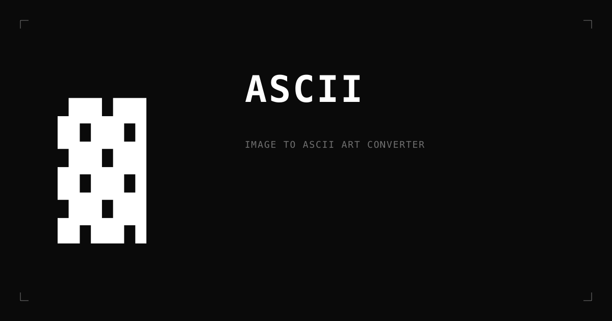

# ASCII

Image to ASCII art converter. Free, client-side, no uploads.

🔗 [ascii.m1ke.digital](https://ascii.m1ke.digital)



## About

Convert any image into ASCII art with full control over character set, density, tone, and color. All processing happens in the browser — no server, no uploads, no tracking.

Built as part of [m1ke.digital](https://m1ke.digital) Labs.

## Features

- 5 character sets (standard, dense, blocks, binary, dots)
- Density and tile aspect control
- Contrast, cut darks, cut lights for fine tonal control
- Three color modes: mono, preserve (original colors), invert
- Three backgrounds: white, black, transparent
- Export as PNG or JPG (1x, 2x, 4x upscale)
- Drag & drop, click, or paste (⌘V) to upload

## Stack

- Next.js 15 (App Router)
- TypeScript
- Tailwind CSS
- IBM Plex Mono
- Canvas 2D for rendering
- Deployed on Vercel

## Running locally

```bash
git clone git@github.com:m1kedigital/ascii.git
cd ascii
pnpm install
pnpm dev
```

Open [http://localhost:3000](http://localhost:3000).

## License

MIT

---

Built by [@m1kedigital](https://m1ke.digital).
